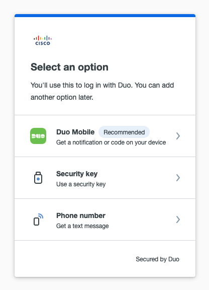

# GVE DevNet Duo Universal Python HTTP Request Demo
Sample demo for Duo Universal using only Duo Auth API's https://duo.com/docs/oauthapi
This allows you to configure a sample Duo Application and protect a user's login with Duo MFA, 
configured through the sample application.

Adapted from Duo Security's demo at [https://github.com/duosecurity/duo_universal_python/tree/main/demo](https://github.com/duosecurity/duo_universal_python/tree/main/demo)


## High Level Design


## Contacts
* Josh Ingeniero (jingenie@cisco.com)

## Solution Components
* Duo
* Python
* Flask

## Installation:

#### Clone the repo
```console
git clone https://github.com/gve-sw/gve_devnet_duo_universal_python_http_request_demo
```
#### Set up a Python venv
First make sure that you have Python 3 installed on your machine. We will then be using venv to create
an isolated environment with only the necessary packages.

##### Install virtualenv via pip
```
$ pip install virtualenv
```

##### Create a new venv
```
Change to your project folder
$ cd gve_devnet_duo_universal_python_http_request_demo/demo

Create the venv
$ virtualenv venv

Activate your venv
$ source venv/bin/activate
```

#### Install dependencies
```
$ pip install -r requirements.txt
```

## Setup

#### Duo Setup

Create a `Web SDK` application in the Duo Admin Panel. See https://duo.com/docs/protecting-applications for more details.


You can deploy this prototype in a lab environment or your own Duo deployment.
You must have your Duo set up with the appropriate configurations in the app.
Fill in the details of your Duo deployment in the [duo.conf](/demo/duo.conf) file in the demo folder.

```
; Duo integration config
[duo]
client_id = DUO_CLIENT_ID
client_secret = DUO_CLIENT_SECRET
api_hostname = api-HOSTNAME.duosecurity.com
redirect_uri = http://localhost:8080/duo-callback
failmode = closed


```


## Usage
These require the appropriate venv to be activated.

### Web App
Run the flask app and navigate to http://localhost:8080 to access the sample login screen. You do not need a valid password for a demo.
You may use a random username or one that is configured from Duo.
```
$ cd demo
$ python app.py
```

From there you will have to go through a login process, onboarding your Duo MFA if not configured.
You will then end up on a response page with a JSON payload containing information about your MFA login,
including endpoint, login context, and authentication status.

#### Sample Auth Response
```json
{
  "aud": "aud",
  "auth_context": {
    "access_device": {
      "browser": "Firefox",
      "browser_version": "112.0",
      "epkey": null,
      "flash_version": "uninstalled",
      "hostname": null,
      "ip": "IP_ADDRESS",
      "is_encryption_enabled": true,
      "is_firewall_enabled": true,
      "is_password_set": true,
      "java_version": "uninstalled",
      "location": {
        "city": "City",
        "country": "Philippines",
        "state": "Metro Manila"
      },
      "os": "Mac OS X",
      "os_version": "13.3.1",
      "security_agents": [
        {
          "security_agent": "cisco-amp",
          "version": "1.21.2.894"
        }
      ]
    },
    "adaptive_trust_assessments": {
      "more_secure_auth": {
        "features_version": "3.0",
        "model_version": "2022.07.19.001",
        "policy_enabled": false,
        "reason": "Normal level of trust; no detection of known attack pattern",
        "trust_level": "NORMAL"
      },
      "remember_me": {
        "features_version": "3.0",
        "model_version": "2022.07.19.001",
        "policy_enabled": false,
        "reason": "Novel Access IP",
        "trust_level": "LOW"
      }
    },
    "alias": "",
    "application": {
      "key": "APP_KEY",
      "name": "Web SDK"
    },
    "auth_device": {
      "ip": "IP_ADDRESS",
      "key": "DEVICE_KEY",
      "location": {
        "city": "City",
        "country": "Philippines",
        "state": "Metro Manila"
      },
      "name": "NAME"
    },
    "email": "",
    "event_type": "authentication",
    "factor": "duo_push",
    "isotimestamp": "2023-04-21T12:38:21.547555+00:00",
    "ood_software": null,
    "reason": "user_approved",
    "result": "success",
    "timestamp": 189418481481,
    "trusted_endpoint_status": "unknown",
    "txid": "67199dfd-b964-40a2-857f-cf80a6c49581",
    "user": {
      "groups": [],
      "key": "KEY",
      "name": "testing"
    }
  },
  "auth_result": {
    "result": "allow",
    "status": "allow",
    "status_msg": "Login Successful"
  },
  "auth_time": 1441,
  "exp": 16826891141414141101,
  "iat": 1682684141425504,
  "iss": "https://api-ISSUER.duosecurity.com/oauth/v1/token",
  "preferred_username": "testing",
  "sub": "testing"
}
```


# Screenshots

### Duo Sample Login Screen


### Duo Onboarding





### Duo Login


### LICENSE

Provided under Cisco Sample Code License, for details see [LICENSE](LICENSE.md)

### CODE_OF_CONDUCT

Our code of conduct is available [here](CODE_OF_CONDUCT.md)

### CONTRIBUTING

See our contributing guidelines [here](CONTRIBUTING.md)

#### DISCLAIMER:
<b>Please note:</b> This script is meant for demo purposes only. All tools/ scripts in this repo are released for use "AS IS" without any warranties of any kind, including, but not limited to their installation, use, or performance. Any use of these scripts and tools is at your own risk. There is no guarantee that they have been through thorough testing in a comparable environment and we are not responsible for any damage or data loss incurred with their use.
You are responsible for reviewing and testing any scripts you run thoroughly before use in any non-testing environment.